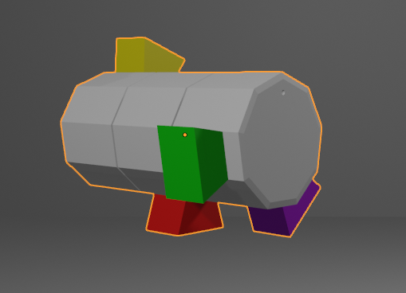

# progetto_IEEE_VR_test_1

NB: le coppie di chiavi sono
1) Public key = (203, 253), Private key = (867, 253)

#### Cube

#### Cylinder

2) Public key = (435, 493), Private key = (379, 493)

#### Cube

#### Cylinder

3) Public key = (811, 893), Private key = (487, 893)

#### Cube

#### Cylinder

4) Public key = (181, 221), Private key = (157, 221)

#### Cube

#### Cylinder

