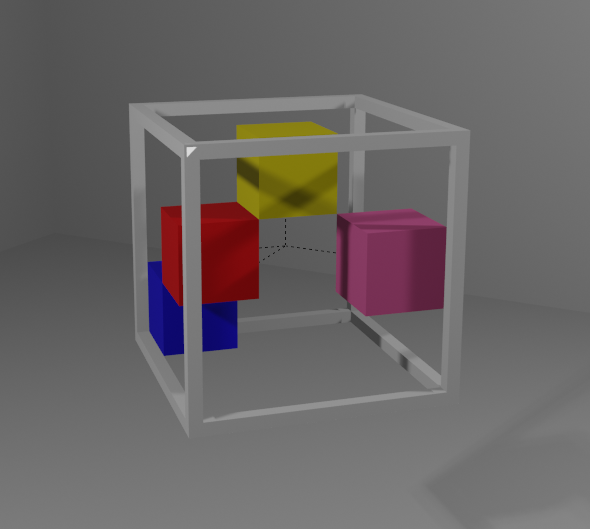

# 3DK-Reate: Create Your Own 3D Key for Distributed Authentication in the Metaverse
#### 2023 IEEE Gaming, Entertainment, and Media Conference (GEM) -> [paper]([https://ieeexplore.ieee.org/abstract/document/10390314]))

 

## Video
Link to video: https://youtu.be/8aWGNW8Q-gI

## Abstract
The Metaverse is becoming a social and economic ecosystem in which users can meet each other, exchange personal data, and make transactions. In this respect, authentication can be easily forecasted to be one of the key aspects for the development of social, immersive Virtual Reality (VR) environments. Notwithstanding, there is still a lack of techniques that can authenticate the users while protecting their sensitive data and leveraging the intrinsic characteristics of VR experiences. In this scenario, the present paper introduces a novel authentication schema based on asymmetric cryptography. More specifically, the proposed approach supports the creation of breakout rooms in which only mutually authenticated users can access. Due to the adoption of the asymmetric cryptography schema, the users are requested to create and insert their personal and secret private keys. To this aim, the current paper proposes and investigates four different interfaces for creating and inserting the keys, leveraging the three-dimensionality of the immersive environment.

Key pairs

#### Key pairs
1) **Public key = (203, 253), Private key = (867, 253)**

#### Cube

#### Cylinder

2) **Public key = (435, 493), Private key = (379, 493)**

#### Cube

#### Cylinder

3) **Public key = (811, 893), Private key = (487, 893)**

#### Cube

#### Cylinder

4) **Public key = (181, 221), Private key = (157, 221)**

#### Cube

#### Cylinder

